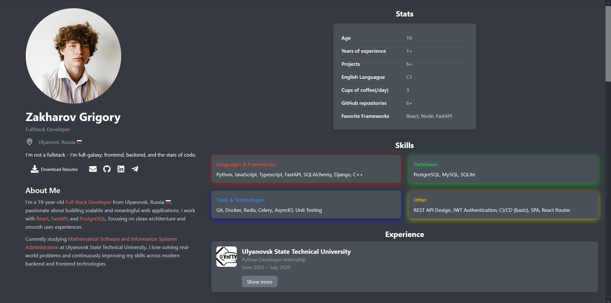

# Grigory Zakharov - Resume

This repository hosts my personal resume website built with **React** and **Vite**. The website is a responsive, interactive portfolio highlighting my skills, experience, education, and projects.



## 🌐 Live Demo

[View the Resume](https://GrigoryZakharov.github.io/resume-en)  


## 💻 Technologies Used

- **Frontend:** React 18, TailwindCSS, Vite  
- **State Management / UI Effects:** AOS (for scroll animations)  
- **Image Optimization:** Custom `SharpImage` component for high-quality image rendering  
- **Icons:** React Icons  
- **Deployment:** GitHub Pages  

## 📦 Project Structure

- `/src` - React components and assets  
- `/public` - Static files  
- `index.html` - Entry point  
- `vite.config.js` - Vite configuration  
- `tailwind.config.js` - Tailwind CSS configuration  

## 🚀 Getting Started

To run the project locally:

1. **Clone the repository:**
   ```bash
   git clone https://github.com/GrigoryZakharov/resume.git
   cd resume


2. **Install dependencies:**

   ```bash
   npm install
   ```

3. **Start the development server:**

   ```bash
   npm run dev
   ```

4. Open your browser and go to [http://localhost:5173](http://localhost:5173)

## 📄 Features

* Fully responsive design for mobile and desktop
* Downloadable resume
* Links to email, GitHub, LinkedIn, and Telegram
* Sections for Bio, Skills, Experience, Education, and Projects
* Smooth scroll animations and hover effects

## ⚡ Notes

* Resume content can be updated via `/src/data` or directly inside components
* Images are optimized for high-quality rendering using the custom `SharpImage` component

## 🔗 Contact

* Email: [zakharov9933@gmail.com](mailto:zakharov9933@gmail.com)
* GitHub: [https://github.com/GrigoryZakharov](https://github.com/GrigoryZakharov)
* LinkedIn: [https://www.linkedin.com/in/grigory-zakharov-577561389/](https://www.linkedin.com/in/grigory-zakharov-577561389/)
* Telegram: [https://t.me/ILoveTankiOnline](https://t.me/ILoveTankiOnline)
